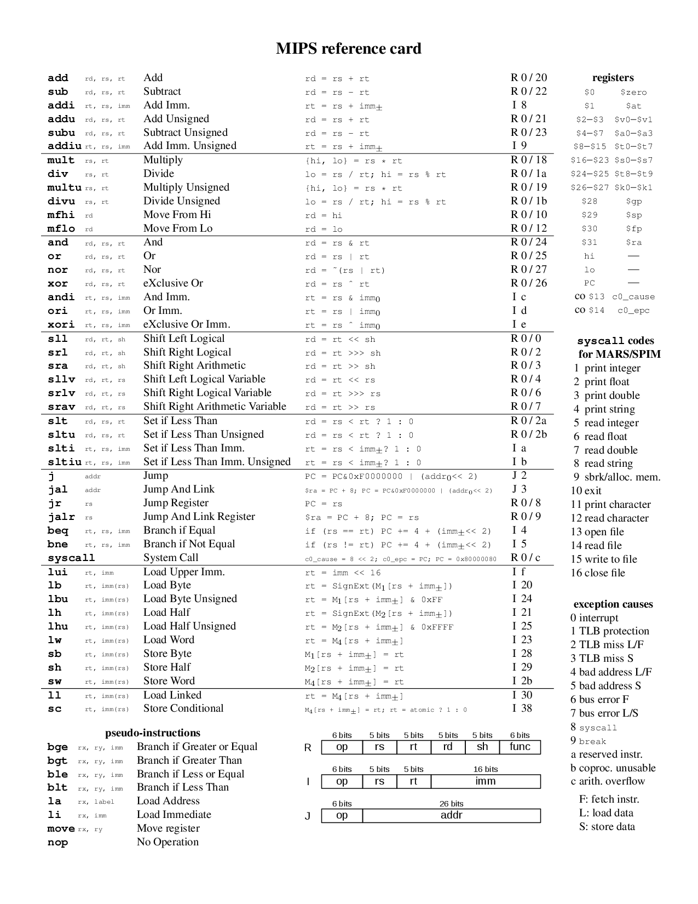
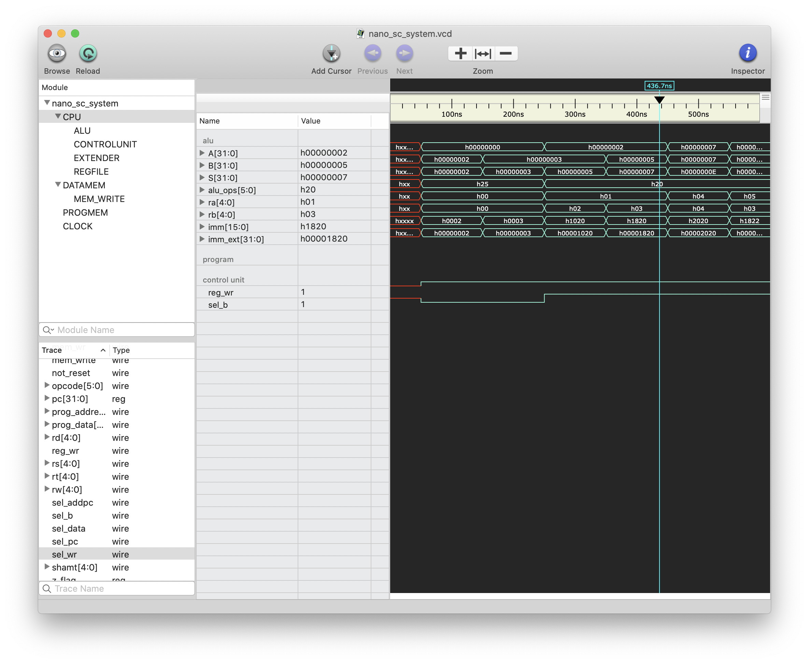
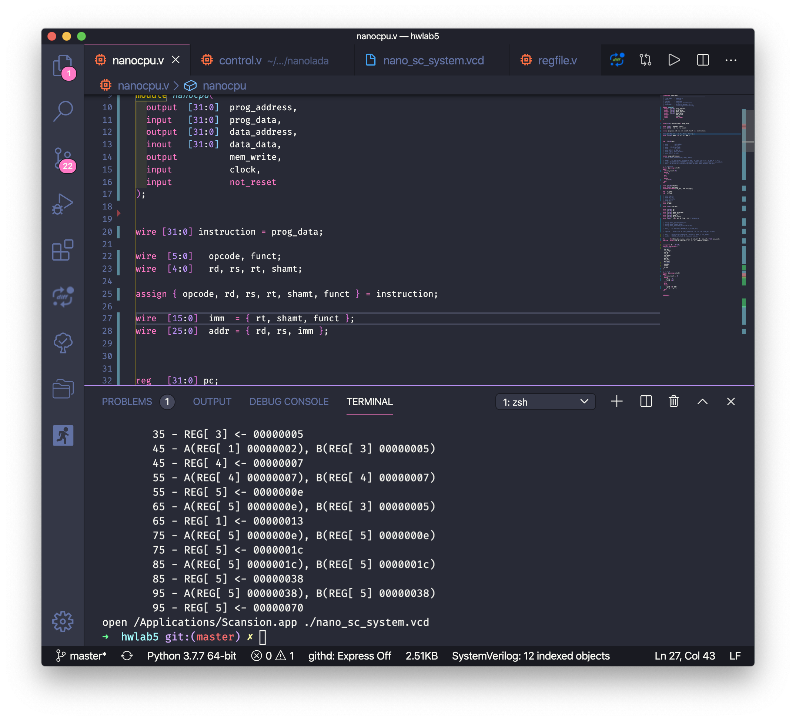

# CPU in Verlilog

basic cpu base on [nanoLADA code](https://www.cp.eng.chula.ac.th/~krerk/books/Computer%20Architecture/nanoLADA/) with MIPS format

base on mac osx config

## Command

| status | op  | command            | func (hex) |
| ------ | --- | ------------------ | ---------- |
| ok     | 0   | add (+)            | 20         |
| ok     | 0   | sub (-)            | 22         |
|        | -   | mul (\*)           | 18         |
|        | -   | div (/)            | 1a         |
|        | 0   | and (&)            | 24         |
|        | 0   | or (\|)            | 25         |
|        | 0   | xor (^)            | 26         |
|        | 0   | slt (<)            | 2a         |
|        | 2   | j (jump)           |
|        | 4   | beq (jmp if eq)    |
|        | 5   | bne (jmp if neq)   |
| ok     | 13  | ori (or immediate) |
|        | 34  | lw (load word)     |
|        | 43  | sw (store word)    |

# ScreenShot

_simulate_

_code \$diaplay_

## resource

[📎 How To Simulate](https://www.youtube.com/watch?v=rwVFDfy2xVI)

[⌛ Table](https://inst.eecs.berkeley.edu/~cs61c/resources/MIPS_help.html)
